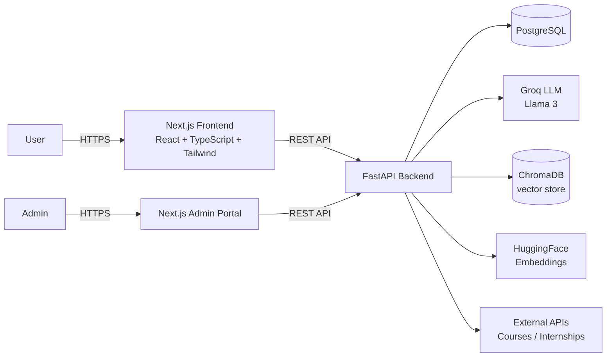

# CareerCure — AI-Powered Career Development Platform

[](https://careeer-cure-seven.vercel.app/)
[](https://nextjs.org/)
[](https://www.typescriptlang.org/)
[](https://fastapi.tiangolo.com/)
[](https://www.postgresql.org/)
[](https://groq.com/)

An end-to-end AI platform that helps students and early-career professionals navigate their career journey — from understanding their current skills to landing their first internship or job.

> **Live Demo:** https://careeer-cure-seven.vercel.app/

---

## Overview

CareerCure is a full-stack web application that combines an **AI career counselor**, **resume analysis and builder**, **personalized career roadmaps**, **course recommendations**, and **internship matching** in a single platform.

Users upload or build their resume, and the system extracts their skills, identifies skill gaps, and suggests a tailored learning and career path. A semantic matching engine surfaces internships and courses that best fit the user's profile. The platform includes secure authentication, a user dashboard, and role-based access, plus a dedicated admin portal for managing users, courses, internships, and system health.

Built as a final-year capstone project, CareerCure demonstrates a complete, production-ready system spanning AI, backend, and frontend engineering.

## Features

- **AI Career Counselling** — Real-time chat with an AI career counselor backed by an LLM and a retrieval-augmented (RAG) knowledge base.
- **Resume Analysis** — Upload a resume and get instant AI feedback: extracted skills, skill gaps, and improvement suggestions.
- **AI Resume Builder** — Create and refine a professional resume with AI-assisted content.
- **Personalized Roadmaps** — Step-by-step career roadmaps tailored to the user's skills and target role.
- **Course Recommendation** — Curated courses from top learning platforms to close skill gaps.
- **Internship Matching** — Semantic matching of internships ranked by fit to the user's profile.
- **Secure Authentication** — Email/password sign-up with OTP verification, password reset, and Google OAuth.
- **User Dashboard** — Central hub showing profile status, recommendations, and progress.
- **Admin Portal** — Role-protected dashboard for user management, course and internship management, and system health monitoring.

## Tech Stack

| Layer      | Technologies                                                                         |
|------------|--------------------------------------------------------------------------------------|
| Frontend   | Next.js, React, TypeScript, Tailwind CSS                                             |
| Backend    | FastAPI, PostgreSQL, SQLAlchemy, JWT                                                 |
| AI         | Groq (Llama 3), LangChain, ChromaDB, HuggingFace Embeddings                          |
| Deployment | Vercel (frontend & backend), Docker (self-hosted)                                    |

## Architecture



## How It Works

1. **Sign up** — Create an account with email/password (OTP verification) or Google OAuth.
2. **Build or upload your resume** — The AI extracts your skills and compares them against your target role.
3. **Chat with the career counselor** — Get grounded answers from an LLM backed by a curated career knowledge base.
4. **Follow your roadmap** — Receive a step-by-step learning and career plan tailored to your goals.
5. **Apply for internships** — Explore internships and courses semantically matched to your profile.

## API Overview

The backend exposes a high-level REST API. See [docs/api-overview.md](docs/api-overview.md) for the full endpoint summary.

```text
POST /chat               — AI career counselor
POST /resume/analyze     — AI resume analysis
GET  /roadmap            — personalized career roadmap
GET  /internships        — semantically matched internships
GET  /courses            — recommended courses
```

## Documentation

- [Features](docs/features.md) — detailed description of every feature
- [Tech Stack](docs/tech-stack.md) — technology details and rationale
- [API Overview](docs/api-overview.md) — high-level API endpoint summary

## Demo Video

Watch a walkthrough of the platform:

[CareerCure Demo](https://drive.google.com/drive/folders/1GkECWuh0zWemvHg-mhGKhFwSjHcmJXK0?usp=sharing)

## Source Code

The complete source code is kept private to protect the intellectual property of this final-year project.

This repository showcases the project's architecture, features, and implementation approach. Recruiters, interviewers, and academic evaluators are welcome to explore the live demo and reach out to discuss the implementation.

## License

[MIT](LICENSE)
